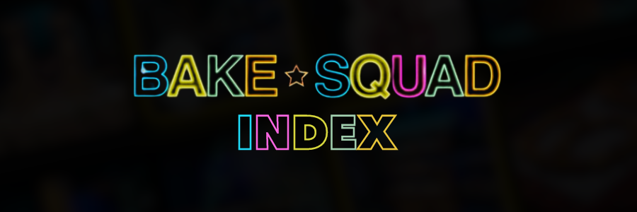

<h1 align="center">
  
</h1>

**Bake Squad Index** is a gallery of all of the creations made by the different bakers on Bake Squad.

> **⚠️ DISCLAIMER**: Images are captured directly from the show, although impainting has occasionally been used to remove the show's labels showing the name of the creation.
## ✅ Usage
<b>🌐 Online: </b> [Click here to go to the website.](https://itsfoxdev.github.io/BakeSquad)

## 🗺️ Roadmap
*🕸️ Nothing here yet... *

`🔴` = Not started‎‎ ‎ ‎ ‎ ‎ `🟡` = In development‎ ‎ ‎ ‎ ‎ `🟢` = Implemented

## ℹ️ Information
Commit icon guide:
- `⬆️` = Uploaded a file
- `🎉` = Major update
- `🐛` = Bug fix
- `🚧` = Test update
- `🏷️` = Text/label edit
- `🗑️` = File removed

## 📦 How to contribute
1. Fork the repository
2. Make changes in the fork
3. Create a pull request
4. Your pull request will be reviewed
